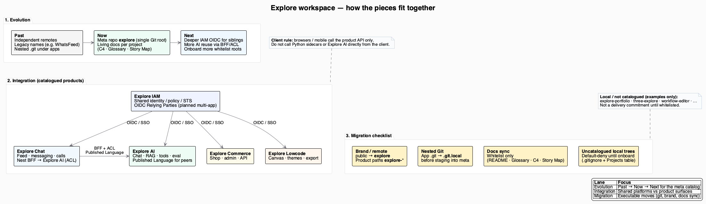

# Explore workspace docs

How catalogued Explore products **fit together** in this meta repository (`felixzhu97/explore`): timeline, connections, and how projects move into the catalog.

Per-product software architecture stays under each project’s `docs/developer/c4-model/`. This folder does not replace those C4 models.

## Workspace Map



Source: [`Workspace-Map.puml`](Workspace-Map.puml)

### How to read

| Lane | Meaning |
|------|---------|
| **Evolution** | Past → Now → Next for the catalog (remotes, living docs, shared platforms) |
| **Integration** | Shared platforms (IAM, AI) vs product surfaces (Chat, Commerce, Lowcode) |
| **Migration** | Executable moves: brand/remote, nested Git, docs whitelist, onboard |

### Catalogued products (links)

| Product | C4 | Glossary | Story Map |
|---------|----|----------|-----------|
| [Explore AI](../explore-ai/README.md) | [c4-model](../explore-ai/docs/developer/c4-model/) | [Glossary](../explore-ai/docs/Glossary.md) | [User Story Map](../explore-ai/docs/product-owner/User-Story-Map.md) |
| [Explore IAM](../explore-iam/README.md) | [c4-model](../explore-iam/docs/developer/c4-model/) | [Glossary](../explore-iam/docs/Glossary.md) | [User Story Map](../explore-iam/docs/product-owner/User-Story-Map.md) |
| [Explore Chat](../explore-chat/README.md) | [c4-model](../explore-chat/docs/developer/c4-model/) | [Glossary](../explore-chat/docs/Glossary.md) | [User Story Map](../explore-chat/docs/product-owner/User-Story-Map.md) |
| [Explore Commerce](../explore-commerce/README.md) | [c4-model](../explore-commerce/docs/developer/c4-model/) | [Glossary](../explore-commerce/docs/Glossary.md) | [User Story Map](../explore-commerce/docs/product-owner/User-Story-Map.md) |
| [Explore Lowcode](../explore-lowcode/README.md) | [c4-model](../explore-lowcode/docs/developer/c4-model/) | [Glossary](../explore-lowcode/docs/Glossary.md) | [User Story Map](../explore-lowcode/docs/product-owner/User-Story-Map.md) |

Uncatalogued local trees (for example `explore-portfolio`) stay default-denied until onboarded — see [sync-repo](../.cursor/skills/developers/public-docs/references/sync-repo.md).

## Render

```bash
brew install plantuml   # macOS
plantuml docs/Workspace-Map.puml
mv docs/Explore-Workspace-Map.png docs/png/Workspace-Map.png
```
