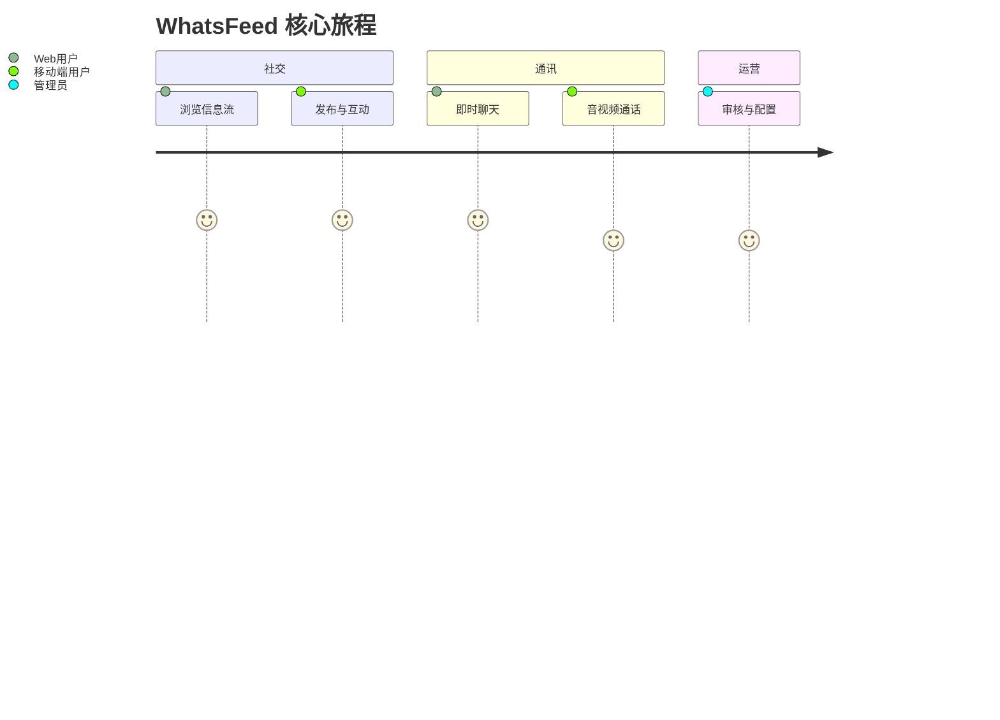

# 用户故事地图

> 格式：Jeff Patton 故事地图 + Mermaid journey + GWT（Epic 分文件）。  
> 故事正文与验收标准见 [user-stories/](./user-stories/)；本页只做索引，避免双源。

## 用户画像

| 角色 | 说明 |
|------|------|
| Web 用户 | 浏览器使用信息流、聊天与探索 |
| 移动端用户 | App 使用信息流、Reels、聊天与通话 |
| 管理员 | 运营用户、内容与安全 |

## 旅程总览

## Backbone 故事地图

### 规划中 / 文档对齐

| 信息流 | 聊天 | 管理 |
|--------|------|------|
| [US-01](./user-stories/E1-feed.md#us-01-浏览信息流) 浏览信息流 | [US-02](./user-stories/E2-chat.md#us-02-即时消息) 即时消息 | [US-03](./user-stories/E3-admin.md#us-03-管理后台) 管理后台 |

## Epic 索引

| Epic | 文件 | 故事 | 状态 |
|------|------|------|------|
| E1 信息流 | [E1-feed.md](./user-stories/E1-feed.md) | US-01 | 规划中 |
| E2 聊天 | [E2-chat.md](./user-stories/E2-chat.md) | US-02 | 规划中 |
| E3 管理 | [E3-admin.md](./user-stories/E3-admin.md) | US-03 | 规划中 |

## 参考

- [User Story Mapping — Jeff Patton](https://www.jpattonassociates.com/user-story-mapping/)
- [Domain Glossary](../Glossary.md)
